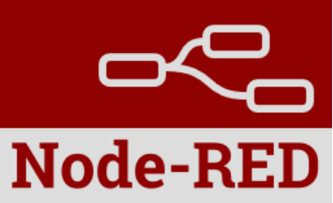
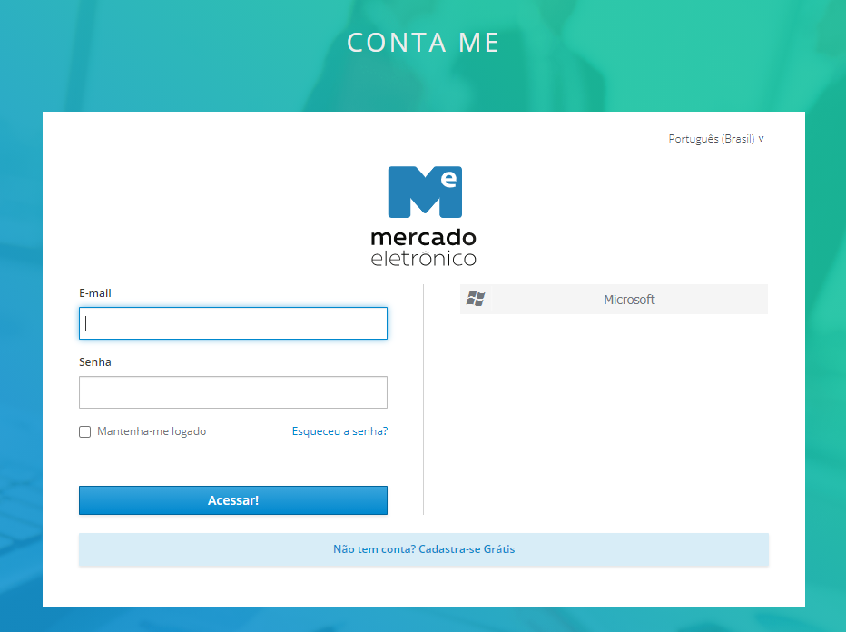

# Hunter

### Acessando o sistema
> Acesse o sistema: [Hunter](https://hunter.qa.miisy.me)

#[code](#code)
#[texto](1)

### Fazendo o login:
> - Após acessar o sistema iremos cair na tela:
>
> 
>
> - Clique no botão `Sign in with ME Account`
> - Iremos cair na página para logar com o a conta ME.
>
> 
>
> - A direita clique no botão `Microsoft`.
>
> 
>
> - Agora iremos colocar o e-mail do ME e clicar no botão `Avançar`.
>
> 
>
> - Agora iremos colocar a senha do e-mail do ME e clicar no botão `Avançar`.
>
> 
>
> - Selecione a flag `Não mostrar isso novamente` e clique no botão `Sim`.
>
> 
>
> - Iremos ver o sistema carregar para o seu usuário.

### Bom dia
>
> See the section on [`Acessando o sistema`](id)
> See the section on [`code`](#code).
> 
> 
> 
> 
> 
> 
> 
> 
> 